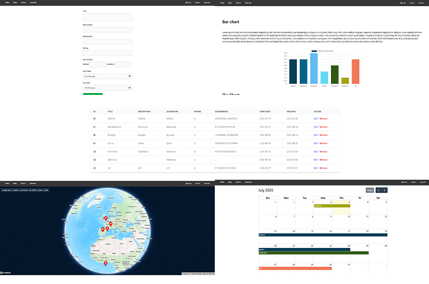

# S8-Tables -and-charts-Angular

<p>
  
</p>

## 📄 Descripción

Este repositorio contiene una aplicación **Travel Journal** desarrollada con **Angular 19**. Permite a los usuarios crear un log de todos sus viajes, y ver charts con estadisticas del rating de cada viaje, un calendario con las fechas de los viajes y un mapa con un marker en cada lugar visitado. Para acceder al contendo debes crear una cuenta y acceder a ella.

## ✨ Características

- **Almanenamiento de datos**: Base de datos alojada en supabase, conectada a cada usuario.
- **Autenticación con Supabase**: Registro e in icio de sesión de usuarios utilizando Supabase Authentication.
- **Interfaz Moderna con CSS vainilla, Angular materials y Tailwind**: Diseño responsivo con CSS y estilos personalizados.
- **Diseño Responsive**: Adaptado para su uso en dispositivos móviles y de escritorio.
  **Despliegue en Vercel**: Aplicación alojada en [Vercel](s8-inprocode-vjh2.vercel.app). ¡Puedes probarla directamente desde tu navegador!
  - Si no deseas crear un usuario, puedes utilizar las siguientes credenciales de prueba:
    - **Email**: `test@mail.com`
    - **Contraseña**: `111111`

## 💻 Tecnologías Utilizadas

- **Angular CLI** version 19.0.7.
- **Supabase Authentication** para la autenticación de usuarios.
- **Supabase Database** para la base de datos.
- **CSS Personalizado**
- **HTML5**
- **TypeScript**

## 📋 Requisitos

- **Node.js** y **npm** instalados en tu sistema. Descárgalos desde [nodejs.org](https://nodejs.org/).
- Angular CLI instalado globalmente:
  ```bash
  npm install
  ```

## 🛠️ Instalación

### **✔️ Requisitos previos**

Asegúrate de tener **Node.js** instalado en tu sistema. Puedes descargarlo desde [nodejs.org](https://nodejs.org/).  
ℹ️ **No es necesario instalar Angular CLI globalmente**, ya que se instalará automáticamente con las dependencias del proyecto.

### **✔️ Instalación paso a paso**

**1️⃣ Clona este repositorio en tu máquina local:**

```bash
git clone https://github.com/sofrayala/S8-Inprocode.git
```

**2️⃣ Ingresa al directorio del proyecto:**

```bash
cd Proyecto
```

**3️⃣ Instala las dependencias necesarias:**

```bash
npm install
```

```bash
npm i @angular/cli
```

## ▶️ Ejecución

Antes de iniciar la aplicación, debes configurar las credenciales de Supabase (https://supabase.com/) y crear una cuenta en la pagina oficial de la API de Mapbox: https://www.mapbox.com/mapbox-studio. En la carpeta `environments/` encontrarás un archivo `environment.example.ts`. Sigue estos pasos:

1. Abre el archivo environment.example.ts, que tiene la siguiente estructura:

```typescript
export const environment = {
  production: false,
  ///////////update your keys here
  SUPABASE_URL: "your supase_project_link",
  SUPABASE_KEY: "your supabase_key",
  MAP_BOX_TOKEN: "your mapBox_key",
};
```

2. Completa los valores de supabase y mapbos con tus credenciales.
3. Renombra el archivo de environment.example.ts a environment.ts, copialo y en la misma carpeta crea otro archivo de environment.development.ts, donde modificas los datos de la primer alinea "production: false".

Para iniciar la aplicación en un entorno de desarrollo, ejecuta:

```bash
ng serve
```

Luego, abre tu navegador y navega a `http://localhost:4200/` para ver la aplicación en acción.

Este README proporciona una guía básica para configurar, utilizar y contribuir al proyecto **S8-Tables -and-charts-Angular**. Asegúrate de consultar la documentación oficial de Angular, Firebase y Tailwind para obtener información más detallada y actualizaciones.
